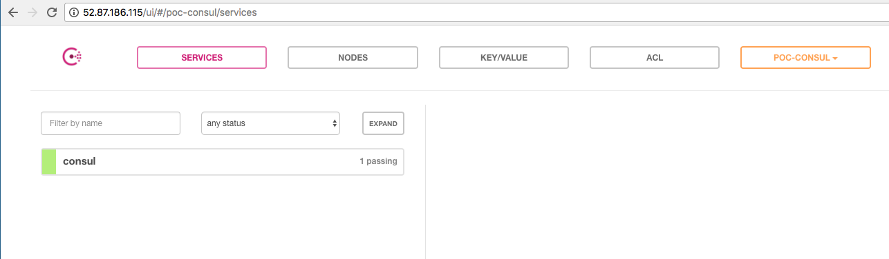

# Proof of Concept (PoC) - Consul

The aim of this PoC is to validate the hypothesis of having a Consul as service discovery and also a key-value database for the future projects.

To run this PoC we used one instance in AWS, however, it could be done all locally.

# Install

See the [link](https://www.consul.io/intro/getting-started/install.html) to install Consul.

# Bootstrap a server

After install Consul generate and save the keygen
```
consul keygen
```

In order to provision a consul server execute  the following step

```
sudo consul agent -config-dir bootstrapp/config.json
```

At this point we should have a Web UI with a server.



ps: We had to allow the ports bellow in the security group.

```
TCP/UDP 8300
TCP/UDP 8301
TCP/UDP 8302
TCP/UDP 8500
TCP/UDP 8600
```
# Initiate a web client

First build the image

```
docker build -t poc/test .
```

and then run the docker as the following command:

```
docker run -it --rm -e node=NAME -p 80:3000 -p 8500:8500 -p 8300:8300 -p 8301:8301 -p 8302:8302 -p 8600:8600 poc/test
```

It is a very simple sinatra application.
